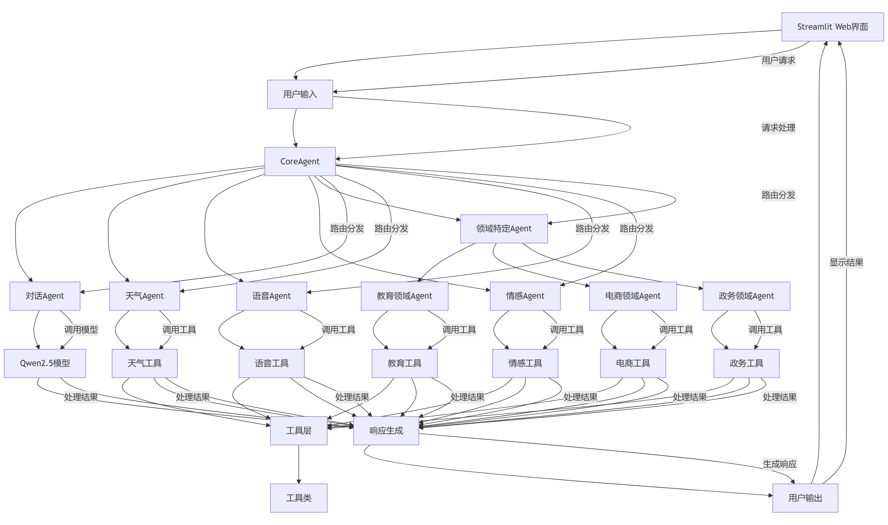
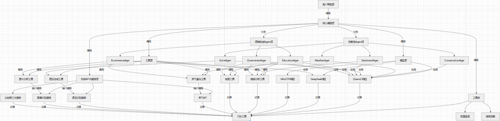

# 多模型协同智能聊天机器人

## 1. 项目说明

### 1.1 项目简介
多模型协同智能聊天机器人是一个基于多Agent协同工作的智能对话系统，集成了Qwen2.5、DeepSeek和MiniCPM等大语言模型，支持文本对话、图片/视频分析、语音交互、天气查询、情感分析等多种功能。系统采用模块化设计，根据用户需求动态调用不同的功能模块，实现智能化的对话交互体验。

### 1.2 系统架构
系统采用多层架构设计，主要包括：
- **交互层（前端）**：基于Streamlit构建的用户友好型界面
- **路由与调度层**：CoreAgent负责解析用户输入并进行意图识别
- **模型与功能调用层**：集成Qwen2.5、DeepSeek和MiniCPM模型
- **领域特定Agent**：提供教育、电商、政务等垂直领域服务
- **工具层**：包括天气查询工具、语音合成工具等
- **日志与监控层**：统一的日志记录与监控

### 1.3 功能特点
- **多模型协同**：动态选择或融合Qwen2.5、DeepSeek和MiniCPM模型。
- **输入方式多样性**：支持多种输入方式，包括文本输入、语音输入，以及图像和视频输入等，满足不同用户的需求。
- **情感分析**：分析用户情感倾向，提供个性化回复。
- **天气查询**：实时获取天气信息并生成可视化图表。
- **领域特定服务**：教育辅导、电商服务、政务服务等。

## 2. 安装部署指南

### 2.1 环境要求
- **Python**：3.8 或更高版本
- **操作系统**：Windows 10/11, Ubuntu 20.04/22.04 LTS, macOS 11.0+
- **硬件要求**：
  - CPU：4核心及以上
  - 内存：8GB及以上
  - 硬盘空间：至少5GB可用空间
- **其他**：已安装`vosk-model-cn-0.22`中文语音模型

### 2.2 依赖安装
1. 克隆或下载项目代码到本地：
   ```bash
   git clone https://github.com/gewei11/Multi-model-intelligent-chatbot
   ```
2. 安装依赖包：
   ```bash
   pip install -r requirements.txt
   ```
3. 安装PyAudio（语音功能依赖）：
   - **Windows系统**：
     ```bash
     pip install pipwin
     pipwin install pyaudio
     ```
   - **Linux系统**：
     ```bash
     sudo apt-get install python3-pyaudio
     ```
   - **MacOS系统**：
     ```bash
     brew install portaudio
     pip install pyaudio
     ```

### 2.3 下载Ollama模型
- **Windows系统**：
  [下载OllamaSetup.exe](https://ollama.com/download/OllamaSetup.exe)
- **Linux系统**：
  ```bash
  curl -fsSL https://ollama.com/install.sh | sh
  ```
- **MacOS系统**：
  [下载Ollama-darwin.zip](https://ollama.com/download/Ollama-darwin.zip)

使用Ollama下载所需的模型：
```bash
ollama run aiden_lu/minicpm-v2.6:Q4_K_M
ollama run MFDoom/deepseek-r1-tool-calling:8b
ollama run qwen2.5:7b
```

### 2.4 配置设置
首次运行时会自动创建`config.yaml`配置文件。编辑`config.yaml`，填入相应的API密钥和配置信息：
```yaml
models:
  qwen:
    model_name: "qwen2.5:7b"
    api_base: "http://localhost:11434/api/chat"
    temperature: 0.7
    max_tokens: 2048
  deepseek:
    model_name: "MFDoom/deepseek-r1-tool-calling:8b"
    api_base: "http://localhost:11434/api/chat"
    temperature: 0.7
    max_tokens: 2048
  minicpm:
    model_name: "aiden_lu/minicpm-v2.6:Q4_K_M"
    api_base: "http://localhost:11434/api/chat"
    temperature: 0.7
    max_tokens: 2048
    vision: true

voice:
  model_path: "vosk-model-cn-0.22"
  sample_rate: 16000
  enabled: true

apis:
  weather:
    api_key: "YOUR_WEATHER_API_KEY"
    base_url: "https://api.seniverse.com/v3/weather/now.json"
    forecast_url: "https://api.seniverse.com/v3/weather/daily.json"
```

### 2.5 启动应用
使用以下命令启动Streamlit应用：
```bash
streamlit run app/streamlit_app.py
```
启动后，应用将在本地运行，通常可以通过浏览器访问 [http://localhost:8501](http://localhost:8501) 打开应用界面。  
在命令行看到以下说明成功启动


## 3. 功能使用说明

### 3.1 用户界面概览
应用界面主要分为以下几个部分：
- **主对话区域**：显示与AI助手的对话历史
- **输入区域**：用于输入文本消息
- **功能按钮区**：包含语音输入、上传图片等功能按钮
- **侧边栏设置**：用于调整模型选择、语音设置等参数

### 3.2 基础功能使用
#### 3.2.1 文本对话
在输入框中输入您的问题或指令，点击发送按钮或按回车键提交。系统会自动处理您的请求并在对话区域显示回复。

#### 3.2.2 语音交互
点击界面上的"开始录音"按钮，对着麦克风说话，说完后点击"停止录音"按钮。系统会自动识别您的语音并处理请求。回复可以选择以文本或语音形式呈现。

#### 3.2.3 图片/视频分析
点击界面上的"Browse files"按钮，选择一张图片/一段视频上传。系统会根据输入的图片/视频进行内容分析，并根据分析结果生成相应的文字描述或执行相关操作。

#### 3.2.4 天气查询
输入类似"北京今天天气怎么样？"或"上海未来三天天气预报"的问题。系统会调用天气API获取相关信息，返回文字描述。

### 3.3 专业领域功能
#### 3.3.1 教育辅导（EducationAgent）
教育Agent提供多学科的知识解答和学习辅导：
- 学科知识查询：输入"请帮我解释一下二次函数的性质"、"介绍一下唐朝的历史"等问题
- 问题解答：输入数学题、物理题等学科问题获取解答
- 学习资源推荐：输入"推荐一些学习高中物理的资料"等请求

#### 3.3.2 电商服务（EcommerceAgent）
电商Agent提供商品查询、推荐和订单管理等功能：
- 商品查询与推荐：输入"手机的性价比怎么看？"、"有什么好用的笔记本电脑推荐？"等
- 订单管理：输入"查询我的订单状态"、"我的包裹什么时候到"等
- 购物建议：输入"双十一有哪些值得购买的商品"等

#### 3.3.3 政务服务（GovernmentAgent）
政务Agent提供政策咨询和办事指南等服务：
- 政策咨询：输入"最新的个人所得税政策是什么"等
- 办事指南：输入"身份证到期了怎么换？"、"社保卡办理需要什么材料？"等

## 4. 技术架构



## 5.视频讲解链接
https://www.bilibili.com/video/BV1hqouYZEys/?vd_source=d144bca9d09669113043bbcceb93e861